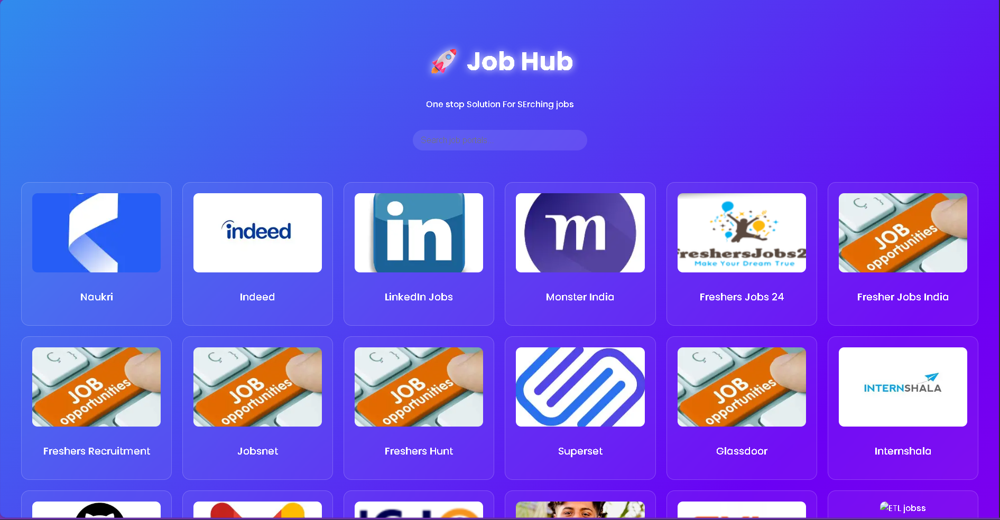

# JobHub

JobHub is a modern and responsive job listing website designed to connect job seekers with employers.  
It provides an attractive interface, futuristic background images, and user-friendly navigation.

## 🚀 Features
- Responsive design for all devices.
- Futuristic look with background images.
- Job listings with company details.
- Easy navigation and modern UI layout.
- “Designed by Vishal” credit.

## 📂 Folder Structure
JobHub/
│── index.html # Main HTML file
│── style.css # CSS for styling
│── images/ # Background images and icons
│── scripts.js # JavaScript (if any)
│── README.md # Project documentation

markdown
Copy
Edit

## 🛠️ Technologies Used
- **HTML5** for structure
- **CSS3** for styling and layout
- **JavaScript** for interactivity
- Background images sourced from free online libraries (Unsplash, Pexels)

## 📸 Screenshots



## 📜 Installation & Usage
1. Clone the repository:
   ```bash
   git clone https://github.com/yourusername/jobhub.git
Open index.html in your browser.

Customize the content, job listings, and background images as needed.

📌 Future Improvements
Add a backend with database integration.

User authentication for employers and job seekers.

Job application tracking system.

Search and filter functionality.

📄 License
This project is open-source and available under the MIT License.

